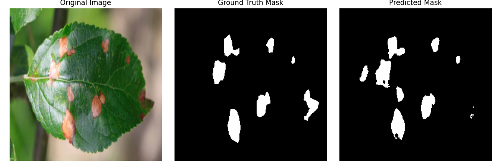
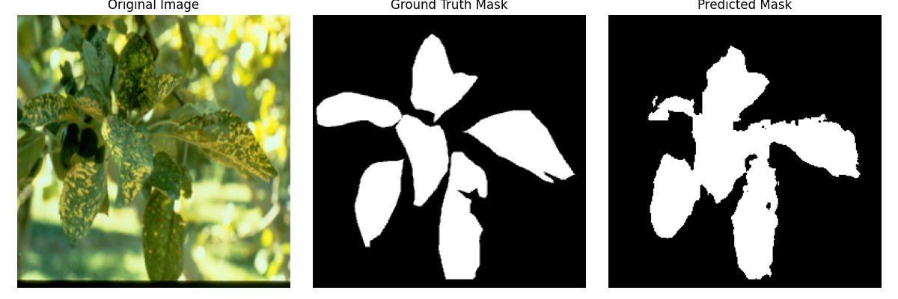
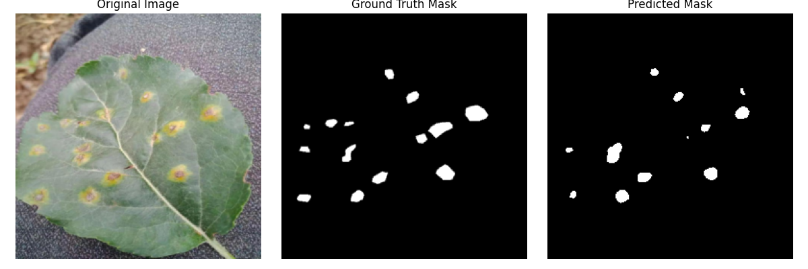
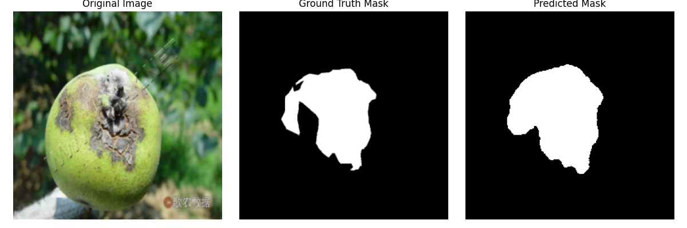

# Image Segmentation using UNet Encoder and BiFPN Decoder using PyTorch

## Overview
This project implements an advanced image segmentation model using:
- **UNet Encoder** from [Ronneberger et al. (2015)](https://arxiv.org/abs/1505.04597)
- **BiFPN Decoder** from [Tan et al. (2019)](https://arxiv.org/abs/1911.09070)
- **Dataset** from [this source](https://arxiv.org/html/2409.04038v1)

The combination of UNet and BiFPN enhances segmentation performance by leveraging the strength of both architectures.

## Dataset
The dataset used for training and evaluation is sourced from [this paper](https://arxiv.org/html/2409.04038v1). It contains a diverse set of images and corresponding segmentation masks.

## Model Architecture
The model consists of:
- **UNet Encoder:** Captures spatial features effectively.
- **BiFPN Decoder:** Enhances multi-scale feature fusion for better segmentation results.
- **Skip Connections:** Allow better gradient flow and feature reuse.

## Results
### Quantitative Results on Test Set
| Metric          | Score  |
|----------------|--------|
| IoU  | 0.4460   |
| Dice Coefficient | 0.5641   |
| Pixel Accuracy | 86.2%  |

### Visual Results
| 
| 
| 
| 

## Acknowledgments
- UNet: https://doi.org/10.48550/arXiv.1505.04597
- BiFPN: https://doi.org/10.48550/arXiv.1911.09070
- Dataset: https://doi.org/10.5281/zenodo.13293891

## License
This project is licensed under the MIT License.

